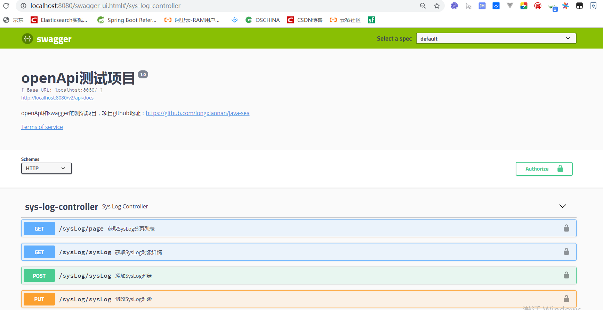

## 如何用OpenApi规范编写接口文档？如何整合swagger？如何导出离线接口文档？

### OpenApi和Swagger的关系

## Springboot整合Swagger

#### 添加依赖

#### yml中进行配置

一些swagger的信息通过在yml中自定义配置后进行加载

#### 添加配置类

#### 整合后测试

##### 原始的swagger页面

访问地址：<http://localhost:8080/swagger-ui.html>

##### 美化的swagger-layui显示页面

> 参考：<https://blog.csdn.net/it_lihongmin/article/details/78829163>

访问地址：<http://localhost:8080/docs.html>

## 用Swagger Editor编写接口文档

## 用Swagger2markup导出swagger离线PDF/HTML文档

在我们开发完后可能需要实现导出离线文档到本地。

需要开启swagger，配置插件后执行test类导出。

参考：<https://www.jianshu.com/p/f0b1ed00c411>
具体搭建：
https://blog.csdn.net/ron03129596/article/details/53559803
