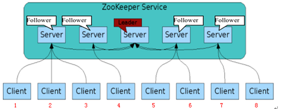

## zookeeper基本知识

### 数据结构

1. 每个**子目录项**（比如图中的**NameService**）都被称为**znode**。
2. **znode**可以有**子节点目录**，并且每个**znode**都可以保存数据，但注意**EPHEMERAL**类型的目录节点不能有子节点目录。
3. **znode**是有**版本的**，每个**znode**中存储的数据可以有多个版本，也就是同一访问路径可以存储多份数据。
4. 对于临时的**znode**，一旦创建这个**znode**的客户端与服务器失去联系，这个**znode**也将自动删除，Zookeeper的客户端和服务器通信采用长链接方式，每个客户端和服务器通过心跳来保持连接。
5. **znode**可以被监控，包括这个节点中存储的数据的修改，子节点目录的变化等，一旦变化可以通知监听的客户端，这个是Zookeeper的重要特性。

### 节点类型

Zookeeper有四种类型的节点:

1. PERSISTENT 持久，若不手动删除就永久存在
2.  PERSISTENT_SEQUENTIAL 持久有序节点，zookeeper会为节点编号（保证有序）
3. EPHEMERAL 临时，一个客户端会话断开后会自动删除
4. 临时有序节点，zookeeper会为节点编号（保证有序）

节点在创建后其类型不能被修改。

Zookeeper提供事件监听机制，通过对节点、节点数据、子节点都提供了监听，我们通过这种监听watcher机制实现锁的等待。

### 基本命令

bin目录下通过客户端连接

```shell
[root@localhost bin]# ./zkCli.sh
```

#### 查看命令：`ls`

连接后进行查看，`zookeeper`是默认的系统节点

```shell
[zk: localhost:2181(CONNECTED) 1] ls /
[test, zookeeper]
[zk: localhost:2181(CONNECTED) 6] ls /zookeeper
[config, quota]
[zk: localhost:2181(CONNECTED) 8] ls /zookeeper/quota
[]
```

#### 获取节点数据命令：`get`

cZxid ：创建节点的id
ctime ： 节点的创建时间
mZxid ：修改节点的id
mtime ：修改节点的时间
pZxid ：子节点的id
cversion : 子节点的版本
dataVersion ： 当前节点数据的版本
aclVersion ：权限的版本
ephemeralOwner ：判断是否是临时节点
dataLength ： 数据的长度
numChildren ：子节点的数量

```shell
[zk: localhost:2181(CONNECTED) 7] get /zookeeper #下面空行说明节点内容为空
[zk: localhost:2181(CONNECTED) 8]
```

#### 获得节点的更新信息：`stat`

```shell
[zk: localhost:2181(CONNECTED) 8] stat /zookeeper
cZxid = 0x0
ctime = Thu Jan 01 00:00:00 UTC 1970
mZxid = 0x0
mtime = Thu Jan 01 00:00:00 UTC 1970
pZxid = 0x0
cversion = -1
dataVersion = 0
aclVersion = 0
ephemeralOwner = 0x0
dataLength = 0
numChildren = 1
```

#### ls命令和stat命令的整合：` ls2`

```shell
[zk: localhost:2181(CONNECTED) 10] ls2 /zookeeper
[quota]
cZxid = 0x0
ctime = Thu Jan 01 00:00:00 UTC 1970
mZxid = 0x0
mtime = Thu Jan 01 00:00:00 UTC 1970
pZxid = 0x0
cversion = -1
dataVersion = 0
aclVersion = 0
ephemeralOwner = 0x0
dataLength = 0
numChildren = 1
[zk: localhost:2181(CONNECTED) 11] 
```

#### 创建节点：`create`

`create [-s] [-e] path data acl` 可以注意一下各个版本的变化

```shell
#创建merryyou节点，节点的内容为merryyou
[zk: localhost:2181(CONNECTED) 1] create /javasea javasea
Created /javasea
#获得merryyou节点内容
[zk: localhost:2181(CONNECTED) 3] get /javasea
javasea
```

#### 创建临时节点：`create -e`

```shell
#创建临时节点
[zk: localhost:2181(CONNECTED) 4] create -e  /javasea/temp javasea
Created /javasea/temp
[zk: localhost:2181(CONNECTED) 5] get /javasea
javasea
[zk: localhost:2181(CONNECTED) 6] get /javasea/temp
javasea
```

#### 删除节点：`delete`

```shell
[zk: localhost:2181(CONNECTED) 12] delete /javasea/temp
[zk: localhost:2181(CONNECTED) 13] delete /javasea
```

### 集群



#### 角色

Zookeeper集群中包含三个角色：

1. **Leader**: 负责进行投票的发起和决议，更新系统的状态，为客户端提供读和写服务。
2. **Follower**: 用于接受客户端请求并且向客户端返回结果，同时在选主过程中参与投票，为客户端提供读服务。
3. **Observer**: 实际上是不参加投票的Follower，用于扩展系统。

其中**Follower**和**Observer**统称为**Learner**，

#### 读写模式

在一个Zookeeper集群中，读写操作可以发生在任何一个集群角色上，而写的请求都会被转发到Leader，然后Leader通过Zookeeper中的原子广播协议（**ZAB**协议，可以理解为Paxos协议的一种简化形式），将请求广播给所有的Learner，当Leader收到一半以上的写成功ACK后，就认为该写操作成功了，则将该操作持久化，并告诉客户端。

#### ZAB协议


ZAB（Atomic broadcast protocol）协议是为Zookeeper专门设计的支持恢复崩溃的原子广播协议，它是Zookeeper实现分布式数据一致性的基础，基于此，Zookeeper实现了一种主备模式的系统架构来保持集群中各个副本之间的数据一致性。

#### Quorum

**Quorum名词解释：** 集群中超过半数的节点集合。

之所以Zookeeper的写操作只需要半数以上的写成功ACK后，就认为该操作成功，是因为**ZAB协议**中的**Quorum**机制。

> **Quorum**解决的是**Read Only Write All**带来的写性能问题，能够不需要更新全部数据，但又保证返回给用户的是有效数据。 **Quorum**的关键在于更新多少个数据副本，使得读取时总能够取到有效数据。假设一共有**N**个副本，其中**k**个已经更新，**N-k**个未更新，那么只要读取集群中**N-k+1**个数据，就一定能读到最新的数据（前文提到，**znode**是具有版本的，选取其中版本最新的即可）。

所以从这里可以看到，Quorum机制为Zookeeper的读写提供了一种调整的可能，在读和写性能中做tradeoff。

#### 四个阶段

注意Zookeeper中的Observer和ZAB协议没有关系。

**第一阶段：Leader election（选举阶段）**

最初时，所有节点都处于选举阶段，当其中一个节点得到了超过了半数节点的票数，它才能当选准Leader。只有达到第三阶段，准Leader才回变成实际的Leader。这一阶段Zookeeper使用的算法有**Fast Leader Election**。

**第二阶段：Discovery（发现阶段）**

这个阶段中，Followers和准Leader进行通信，同步Followers最近最近接收的事务提议。这一阶段的主要目的是发现当前大多数节点接受的最新提议，并让Followers接收准Leader定义的epoch（相当于朝代号，每一代Leader会有自己的epoch）。

**第三阶段：Synchronization（同步阶段）**

同步阶段主要是利用Leader前一阶段获得的最新提议历史，同步集群中的所有副本。只有当Quorum都同步完成，准Leader才回称为真的Leader。

**第四阶段：Broadcast（广播阶段）**

这个阶段Zookeeper才能够正式对外提供事务服务，并且Leader可以进行消息广播。

#### 2N+1

Zookeeper有这么一个特性：**集群中只要有过半的机器是正常工作的，那么整个集群对外就是可用的** ，所以容错性上讲，2N和2N-1的容错性都是N-1，而2N+1的容错性为N，所以一般推荐节点数配置为奇数个。为什么会有这样一个特性了？因为Zookeeper的大多数行为都是基于投票的，需要半数以上的节点同意才能执行。

## zookeeper的客户端

### 原生客户端

依赖：

```xml
<dependency>
    <groupId>org.apache.zookeeper</groupId>
    <artifactId>zookeeper</artifactId>
    <version>3.5.5</version>
</dependency>
```

测试类：


访问`http://localhost:8088/test/world`

页面显示：[127.0.0.1:8088]

在zookeeper通过客户端工具查看：

```shell
[zk: localhost:2181(CONNECTED) 42] ls /registry/HelloService/address-0000000012
[]
[zk: localhost:2181(CONNECTED) 43] get /registry/HelloService/address-0000000012
127.0.0.1:8088
```

### zkclient

代码示例

### curator

代码示例

## 实现分布式锁


## 参考：

[curator分布式锁源码分析参考](http://www.dengshenyu.com/java/分布式系统/2017/10/23/zookeeper-distributed-lock.html)  

https://juejin.im/post/5b7ccea3e51d4538c77a810c#heading-10
http://sadwxqezc.github.io/HuangHuanBlog/middleware/2017/02/08/Zookeeper%E7%AC%94%E8%AE%B0.html