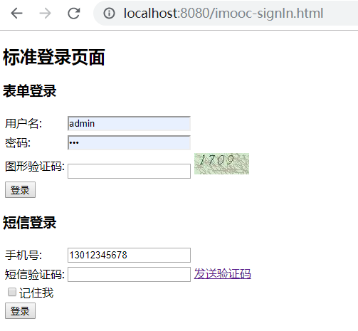

[TOC]

# javasea-rbac-security

mybatis，spring，mysql数据库

## 项目结构

* javasea-rbac-security-core

  核心组件项目，登陆和验证码相关的通用功能封装在改项目中

* javasea-rbac-security-app

  app端登陆和验证码相关功能

* javasea-rbac-security-browser

  web登陆和验证码相关功能

* javasea-rbac-security-demo

  使`javasea-rbac-security`时需要编写的项目，如果是使用`app`端的登陆，那么`pom`中添加`javasea-rbac-security-app`依赖；如果是`web`端的登陆，那么`pom`中添加`javasea-rbac-security-browser`依赖

## 如何配置和使用

> 实际使用中，参考`javasea-rbac-security-demo`项目是使用的案例, 即可实现登陆和验证码功能。下文只举例在`javasea-rbac-security-demo`项目中如果要实现web登陆和验证码的相关功能改如何配置。

### pom配置

因为我们是实现web端的登陆和验证码功能，故在pom中添加browser依赖

```xml
<dependency>
    <groupId>com.javasea.security</groupId>
    <artifactId>javasea-rbac-security-browser</artifactId>
    <version>${javasea.security.version}</version>
</dependency>
```

### 配置文件配置

* 配置数据源

  ```yml
  spring:
    datasource:
      driver-class-name: com.mysql.jdbc.Driver
      url: jdbc:mysql://127.0.0.1:3306/my?useUnicode=yes&characterEncoding=UTF-8&useSSL=false
      username: root
      password: 123
    session:
      store-type: none
  ```

* 登陆和验证码相关功能自定义

  ```yml
  javasea:
    security:
      browser:
  #      signInPage: /demo-signIn.html   # 可以自定义登陆页面，默认是javasea-rbac-security-browser项目下的imooc-signIn.html
        signInResponseType: REDIRECT   #JSON或者REDIRECT，默认是JSON
      code:
        image:
          length: 4                    #自定义图片验证码长度，默认是4
          width: 100                   #图片验证码宽度，默认是67
          height: 30                   #图片验证码高度， 默认是23
          expireIn: 30                 #图片验证码过期时间，单位秒，默认是60秒
          url: /user,/user/*           #添加自定义拦截的url，默认已经添加登陆请求的拦截，支持ant模式，配置后，访问该url会进行验证码校验，如果验证不通过则不可访问
        sms:
          length: 6                    #自定义短信验证码长度，默认是6
          expireIn: 60                 #自定义验证码过期时间，默认是60秒
          url: /user,/user/*
  ```

### 演示

访问地址：

<http://localhost:8080/index.html>，因为未登陆，所以会跳转到<http://localhost:8080/imooc-signIn.html>


## 流程和源码分析

### 登陆页面跳转

在`BrowserSecurityConfig`类定义了为授权页面重定向url`/authentication/require`， 所以访问http://localhost:8080/index.html时, 因为未授权，会重定向到`/authentication/require`。

BrowserSecurityConfig类定义登陆和授权信息：


`BrowserSecurityController`类定义了URL `/authentication/require`的处理方式


访问：<http://localhost:8080/user>

返回：


访问：<http://localhost:8080/index.html>

跳转到了登录页：



### 登陆处理

#### 成功和失败处理器

失败处理器: `ImoocAuthenticationFailureHandler`

成功处理器：`ImoocAuthenticationSuccessHandler`

在`SmsCodeAuthenticationSecurityConfig`类添加了`成功处理器`和`失败处理器`到`SmsCodeAuthenticationFilter`， 用于处理短信登陆时成功和失败处理方式。

在`BrowserSecurityConfig`类添加了也添加了成功处理器和失败处理器到`UsernamePasswordAuthenticationFilter`，用于处理用户名和密码登陆时的成功和失败处理方式。

在上文的`application.yaml`中配置了`signInResponseType`，在成功和失败处理器中通过该类型选择是跳转还是返回json：

```yaml
javasea:
  security:
    browser:
      signInResponseType: REDIRECT   #JSON或者REDIRECT，默认是JSON
```

### 验证码

#### 验证码获取

验证码通过`ValidateCodeController`类的`createCode`方法获取，采用策略模式和模板方法模式，通过匹配是图片还是短信来分配图片验证码还是短信验证码。

#### 验证码校验

验证码通过`ValidateCodeFilter`过滤器的`doFilterInternal`方法进行校验：如果是需要验证码的url，那么会校验出结果返回。

在`ValidateCodeSecurityConfig`配置类中，将`ValidateCodeFilter`添加到了过滤器链。

