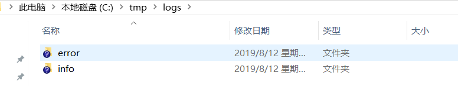

# logback将日志存入数据库

[TOC]

## pom配置

添加依赖：

```xml
<dependency>
            <groupId>org.springframework.boot</groupId>
            <artifactId>spring-boot-starter-web</artifactId>
        </dependency>
```

> 该依赖中已经集成了logback

## 数据库中建表

```SQL
BEGIN;
DROP TABLE IF EXISTS logging_event;
COMMIT;
BEGIN;
CREATE TABLE logging_event
  (
    timestmp         BIGINT NOT NULL,
    formatted_message  TEXT NOT NULL,
    logger_name       VARCHAR(254) NOT NULL,
    level_string      VARCHAR(254) NOT NULL,
    thread_name       VARCHAR(254),
    reference_flag    SMALLINT,
    arg0              VARCHAR(254),
    arg1              VARCHAR(254),
    arg2              VARCHAR(254),
    arg3              VARCHAR(254),
    caller_filename   VARCHAR(254) NOT NULL,
    caller_class      VARCHAR(254) NOT NULL,
    caller_method     VARCHAR(254) NOT NULL,
    caller_line       CHAR(4) NOT NULL,
    event_id          BIGINT NOT NULL AUTO_INCREMENT PRIMARY KEY
  );
COMMIT;

```

## 配置测试类

```java

@Slf4j
@RestController
public class DemoController {

    @GetMapping("/test")
    public void test(){
        log.error("error test");
        log.info("info test");
        log.debug("debug test");
    }
}
```

## logback-spring.xml的不同配置方式

### 1. 将log备份到mysql的spring-logback.xml配置

> log配置参考：logback-spring.mysqlbak

```xml
<?xml version="1.0" encoding="UTF-8"?>
<configuration debug="false">
    <!--定义日志文件的存储地址 勿在 LogBack 的配置中使用相对路径-->
    <property name="LOG_HOME" value="c:/tmp/logs" />
    <!-- 控制台输出 -->
    <appender name="STDOUT" class="ch.qos.logback.core.ConsoleAppender">
        <encoder class="ch.qos.logback.classic.encoder.PatternLayoutEncoder">
            <!--格式化输出：%d表示日期，%thread表示线程名，%-5level：级别从左显示5个字符宽度%msg：日志消息，%n是换行符-->
            <pattern>%d{yyyy-MM-dd HH:mm:ss.SSS} [%thread] %-5level %logger{50} - %msg%n</pattern>
            <charset>UTF-8</charset>
        </encoder>
    </appender>
    <!-- 按照每天生成日志文件 -->
    <appender name="FILE"  class="ch.qos.logback.core.rolling.RollingFileAppender">
        <rollingPolicy class="ch.qos.logback.core.rolling.TimeBasedRollingPolicy">
            <!--日志文件输出的文件名-->
            <FileNamePattern>${LOG_HOME}/TestWeb.log.%d{yyyy-MM-dd}.log</FileNamePattern>
            <!--日志文件保留天数-->
            <MaxHistory>30</MaxHistory>
        </rollingPolicy>
        <encoder class="ch.qos.logback.classic.encoder.PatternLayoutEncoder">
            <!--格式化输出：%d表示日期，%thread表示线程名，%-5level：级别从左显示5个字符宽度%msg：日志消息，%n是换行符-->
            <pattern>%d{yyyy-MM-dd HH:mm:ss.SSS} [%thread] %-5level %logger{50} - %msg%n</pattern>
            <charset>UTF-8</charset>
        </encoder>
        <!--日志文件最大的大小-->
        <triggeringPolicy class="ch.qos.logback.core.rolling.SizeBasedTriggeringPolicy">
            <MaxFileSize>10MB</MaxFileSize>
        </triggeringPolicy>
    </appender>

    <!-- 将日志存储到oracle数据库中 -->
    <appender name="DB" class="ch.qos.logback.classic.db.DBAppender">
        <connectionSource class="ch.qos.logback.core.db.DriverManagerConnectionSource">
            <driverClass>com.mysql.jdbc.Driver</driverClass>
            <url>jdbc:mysql://127.0.0.1:3306/my</url>
            <user>root</user>
            <password>123456</password>
        </connectionSource>
        <!-- 如果配置多个LevelFilter，那么只有第一个生效。如果不配置，那么所有日志都保存到mysql -->
        <!--<filter class="ch.qos.logback.classic.filter.LevelFilter">&lt;!&ndash; 只打印错误日志 WARN &ndash;&gt;-->
            <!--<level>INFO</level>-->
            <!--<onMatch>ACCEPT</onMatch>-->
            <!--<onMismatch>DENY</onMismatch>-->
        <!--</filter>-->
        <!--<filter class="ch.qos.logback.classic.filter.LevelFilter">&lt;!&ndash; 只打印错误日志 WARN &ndash;&gt;-->
            <!--<level>ERROR</level>-->
            <!--<onMatch>ACCEPT</onMatch>-->
            <!--<onMismatch>DENY</onMismatch>-->
        <!--</filter>-->
    </appender>

    <!-- show parameters for hibernate sql 专为 Hibernate 定制 -->
    <logger name="org.hibernate.type.descriptor.sql.BasicBinder"  level="TRACE" />
    <logger name="org.hibernate.type.descriptor.sql.BasicExtractor"  level="DEBUG" />
    <logger name="org.hibernate.SQL" level="DEBUG" />
    <logger name="org.hibernate.engine.QueryParameters" level="DEBUG" />
    <logger name="org.hibernate.engine.query.HQLQueryPlan" level="DEBUG" />

    <!--myibatis log configure-->
    <logger name="com.apache.ibatis" level="TRACE"/>
    <logger name="java.sql.Connection" level="DEBUG"/>
    <logger name="java.sql.Statement" level="DEBUG"/>
    <logger name="java.sql.PreparedStatement" level="DEBUG"/>

    <!-- 日志输出级别 -->
    <root level="INFO">
        <appender-ref ref="STDOUT" />
        <appender-ref ref="FILE" />
        <appender-ref ref="DB"/>
    </root>
</configuration>

```

### 效果


### 2. mysql异步IO且将info，error级别日志分别输出的logback-spring.xml配置

> 参考：<https://juejin.im/post/5d4d61326fb9a06aff5e5ff5?utm_source=gold_browser_extension>
>
> log配置参考：logback-spring.asy

```xml
<?xml version="1.0" encoding="utf-8"?>
<configuration>
    <!--<property resource="logback.properties"/>-->
    <!--定义日志文件的存储地址 勿在 LogBack 的配置中使用相对路径-->
    <property name="LOG_INFO_HOME" value="c:/tmp/logs/info" />

    <property name="LOG_ERROR_HOME" value="c:/tmp/logs/error" />

    <appender name="LOG_INFO_HOME" class="ch.qos.logback.core.ConsoleAppender">
        <layout class="ch.qos.logback.classic.PatternLayout">
            <pattern>[%d{yyyy-MM-dd' 'HH:mm:ss.sss}] [%C] [%t] [%L] [%-5p] %m%n</pattern>
        </layout>
    </appender>

    <!-- 控制台输出 -->
    <appender name="CONSOLE-LOG" class="ch.qos.logback.core.ConsoleAppender">
        <encoder class="ch.qos.logback.classic.encoder.PatternLayoutEncoder">
            <!--格式化输出：%d表示日期，%thread表示线程名，%-5level：级别从左显示5个字符宽度%msg：日志消息，%n是换行符-->
            <pattern>%d{yyyy-MM-dd HH:mm:ss.SSS} [%thread] %-5level %logger{50} - %msg%n</pattern>
            <charset>UTF-8</charset>
        </encoder>
    </appender>
    <!--获取比info级别高(包括info级别)但除error级别的日志-->
    <appender name="INFO-LOG" class="ch.qos.logback.core.rolling.RollingFileAppender">
        <!-- 获取比info级别高(包括info级别 和 ERROR级别) -->
        <filter class="ch.qos.logback.classic.filter.ThresholdFilter">
            <level>INFO</level>
        </filter>
        <!-- 排除掉ERROR级别 -->
        <filter class="ch.qos.logback.classic.filter.LevelFilter">
            <level>ERROR</level>
            <onMatch>DENY</onMatch>
            <onMismatch>ACCEPT</onMismatch>
        </filter>
        <encoder>
            <pattern>[%d{yyyy-MM-dd' 'HH:mm:ss.sss}] [%C] [%t] [%L] [%-5p] %m%n</pattern>
        </encoder>

        <!--滚动策略-->
        <rollingPolicy class="ch.qos.logback.core.rolling.TimeBasedRollingPolicy">
            <!--路径-->
            <fileNamePattern>${LOG_INFO_HOME}//%d.log</fileNamePattern>
            <maxHistory>30</maxHistory>
        </rollingPolicy>
    </appender>
    <appender name="ERROR-LOG" class="ch.qos.logback.core.rolling.RollingFileAppender">
        <filter class="ch.qos.logback.classic.filter.ThresholdFilter">
            <level>ERROR</level>
        </filter>
        <encoder>
            <pattern>[%d{yyyy-MM-dd' 'HH:mm:ss.sss}] [%C] [%t] [%L] [%-5p] %m%n</pattern>
        </encoder>
        <!--滚动策略-->
        <rollingPolicy class="ch.qos.logback.core.rolling.TimeBasedRollingPolicy">
            <!--路径-->
            <fileNamePattern>${LOG_ERROR_HOME}//%d.log</fileNamePattern>
            <maxHistory>30</maxHistory>
        </rollingPolicy>
    </appender>

    <!-- 实现异步输出
     之前的日志配置方式是基于同步的，每次日志输出到文件都会进行一次磁盘IO。
     采用异步写日志的方式而不让此次写日志发生磁盘IO，阻塞线程从而造成不必要的性能损耗。
     异步输出日志的方式很简单，添加一个基于异步写日志的appender，并指向原先配置的appender即可
     -->
    <appender name="ASYNC-INFO" class="ch.qos.logback.classic.AsyncAppender">
        <!-- 不丢失日志.默认的,如果队列的80%已满,则会丢弃TRACT、DEBUG、INFO级别的日志 -->
        <discardingThreshold>0</discardingThreshold>
        <!-- 更改默认的队列的深度,该值会影响性能.默认值为256 -->
        <queueSize>256</queueSize>
        <!-- 添加附加的appender,最多只能添加一个 -->
        <appender-ref ref="INFO-LOG"/>
    </appender>
    <appender name="ASYNC-ERROR" class="ch.qos.logback.classic.AsyncAppender">
        <!-- 不丢失日志.默认的,如果队列的80%已满,则会丢弃TRACT、DEBUG、INFO级别的日志 -->
        <discardingThreshold>0</discardingThreshold>
        <!-- 更改默认的队列的深度,该值会影响性能.默认值为256 -->
        <queueSize>256</queueSize>
        <!-- 添加附加的appender,最多只能添加一个 -->
        <appender-ref ref="ERROR-LOG"/>
    </appender>


    <root level="info">
        <appender-ref ref="CONSOLE-LOG" />
        <appender-ref ref="INFO-LOG" />
        <appender-ref ref="ERROR-LOG" />
    </root>
</configuration>


```

### 效果



