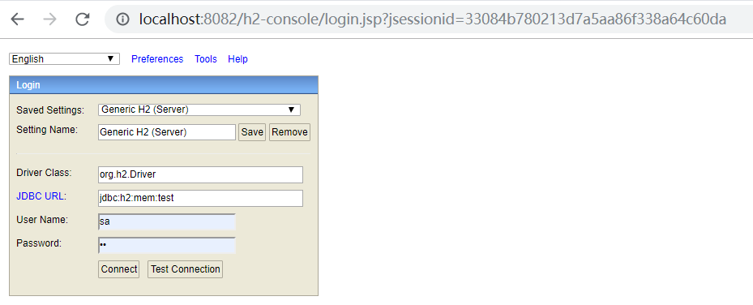
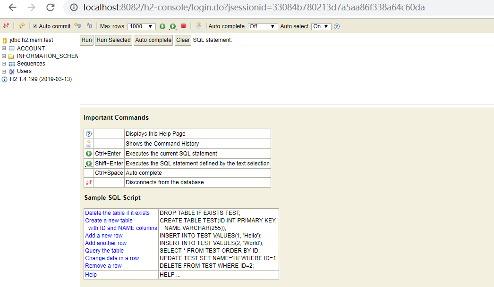

# Spring boot最佳实践

本项目用于展示个人在使用Spring开发的过程中总结的最佳实践

* 统一异常处理
* 使用 Valid 注解做参数校验，并统一处理校验不通过的异常
* 使用 lombok 简化开发
* 使用 Swagger 自动化 API 文档
* REST 接口统一返回 ResultBean\<T\>
* 通过构造器注入
* 整合h2数据库

# 启动方式

1. 然后直接启动：

`mvn spring-boot:run`

2. 运行主类:
`WebBaseApplication.java`

启动之后浏览器打开 http://localhost:8082/swagger-ui.html#/ 可以查看 Swagger 文档

## 整合

### 整合h2

#### 配置数据源和h2

```yaml
spring:
  datasource:
    driver-class-name: org.h2.Driver
    url: jdbc:h2:mem:test;
    password: sa
    username: sa
    schema: classpath:/db/schema.sql
    data: classpath:/db/data.sql
  h2:
    # h2 web consloe 是一个数据库GUI管理应用，程序运行时，会自动启动h2 web consloe
    console:
      path: /h2-console
      # 开启 h2 web console ，默认开启
      enabled: true
      settings:
        # 配置后 h2 web console 就可以在远程访问，否则只能在本机访问
        web-allow-others: true
```

#### 测试

访问：<http://localhost:8082/h2-console/login.do?jsessionid=33084b780213d7a5aa86f338a64c60da>





### 整合swagger

swagger注解详解

```java

@Api：用在请求的类上，表示对类的说明
    tags="说明该类的作用，可以在UI界面上看到的注解"
    value="该参数没什么意义，在UI界面上也看到，所以不需要配置"
 
 
@ApiOperation：用在请求的方法上，说明方法的用途、作用
    value="说明方法的用途、作用"
    notes="方法的备注说明"
 
 
@ApiImplicitParams：用在请求的方法上，表示一组参数说明
    @ApiImplicitParam：用在@ApiImplicitParams注解中，指定一个请求参数的各个方面
        name：参数名
        value：参数的汉字说明、解释
        required：参数是否必须传
        paramType：参数放在哪个地方
            · header --> 请求参数的获取：@RequestHeader
            · query --> 请求参数的获取：@RequestParam
            · path（用于restful接口）--> 请求参数的获取：@PathVariable
            · body（不常用）
            · form（不常用）    
        dataType：参数类型，默认String，其它值dataType="Integer"       
        defaultValue：参数的默认值
 
 
@ApiResponses：用在请求的方法上，表示一组响应
    @ApiResponse：用在@ApiResponses中，一般用于表达一个错误的响应信息
        code：数字，例如400
        message：信息，例如"请求参数没填好"
        response：抛出异常的类
 
 
@ApiModel：用于响应类上，表示一个返回响应数据的信息
            （这种一般用在post创建的时候，使用@RequestBody这样的场景，
            请求参数无法使用@ApiImplicitParam注解进行描述的时候）
    @ApiModelProperty：用在属性上，描述响应类的属性
```


## 参考：

#### 参数校验参考：
https://juejin.im/post/5d3fbeb46fb9a06b317b3c48?utm_source=gold_browser_extension
