## activity建表

### 创建数据库

```sql
DROP DATABASE activiti;
CREATE DATABASE activiti;
```

### 创建表

## API操作：

### 流程定义相关

### 流程实例相关

### 任务相关

```java
//没参与者，但是候选人是该user
List<Task> taskList = taskService.createTaskQuery().taskCandidateUser(user.getId()).list();
//本人就是参与者
List<Task> assigneeList = taskService.createTaskQuery().taskAssignee(user.getId()).list(); 
//没有参与者，但是候选人相同group的
List<Task> candidateGroup = taskService.createTaskQuery().taskCandidateGroupIn(roleString).list(); 
```

流程变量设置方式：


### Global全局流程变量

- 如果UEL表达式中流程变量名不存在则报错。
- 如果UEL表达式中流程变量值为空NULL，流程不按UEL表达式去执行，而流程结束。
- 如果UEL表达式都不符合条件，流程结束。
- 如果连线不设置条件，会走flow序号小的那条线。

#### 在启动流程实例时设置流程变量


#### 通过实例id设置流程变量

```java
Holiday holiday = new Holiday();

holiday.setNum(3);

runtimeService.setVariable(流程实例id， "holiday", holiday);
```

#### 通过在完成任务时设置流程变量

#### 通过任务id设置流程变量

### Local局部流程变量

只能在task中设置，跟task设置的global变量类似，方法后面添加Local解决。也就是说同流程的的不同流程节点的任务中，可以设置同名的变量，互不影响。

```java
//通过任务id设置局部流程变量, 局部变量只能在该任务结束前使用，任务结束后该变量无法在当前流程实例使用，可以通过查询历史任务查询。
taskService.setVariableLocal(task.getId(), "holiday", map);
```

### 网关

#### 排他网关

排他网关只会选择一个为true去执行。（即使有两个分支条件都为true，排他网关也会只选择一个分支去执行）。如果都不为true则抛出异常

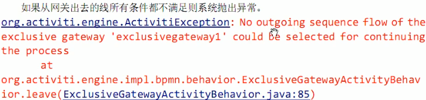

#### 并行网关

并行网关允许将流程分成多条分支，也可以把多条分支汇聚到一起，并行网关的功能是基于进入和外出顺序流的：

* fork分支

并行后的所有外出顺序流，为每个顺序流都创建一个并发分支。

* join汇聚

所有到达的并行网关，在此等待的进入分支，直到所有进入顺序流的分支都到达后，流程就会通过汇聚网关。

> 如果同一个并行网关有多个进入和多个外出顺序流，它就同时具有分支和汇聚功能。这时，网关会先汇聚所有进入的顺序流，然后再切分成多个并行分支，且分支的时候<font color=red>忽略条件</font>。

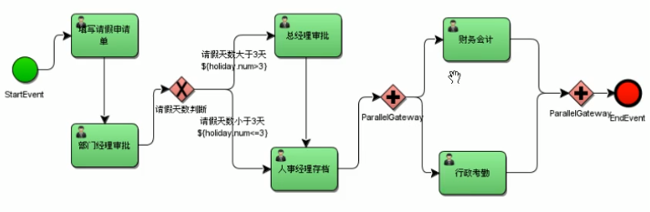

完成`财务会计`后，`parallelGateway`(第二个并行网关)就有结束时间了。

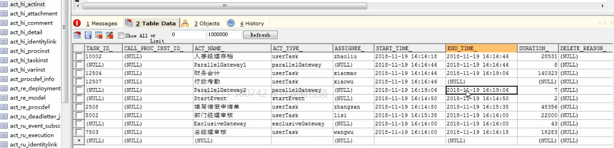

完成`行政考勤`，出现第二条parallelGateway的汇聚记录

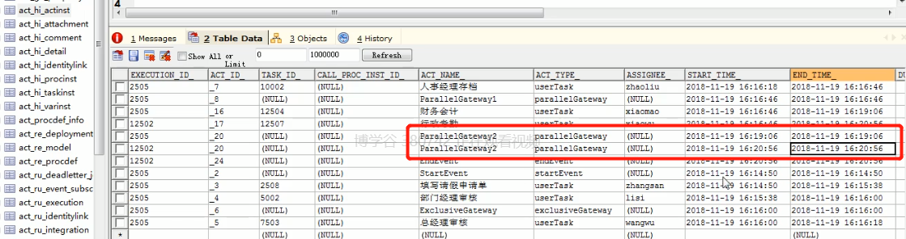

#### 包含网关

为true的的分支都跑，且true的分支都汇聚后流程才结束

#### 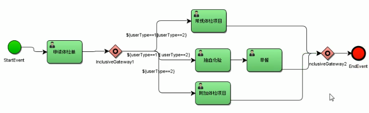

只有`常规体检项目`、`早餐`、`附加体检项目`全部完成后，inclusiveGateway2（第二个包含网关）才有结束时间。


### 

/src/main/resources/processes/

## 排他网关流程演示

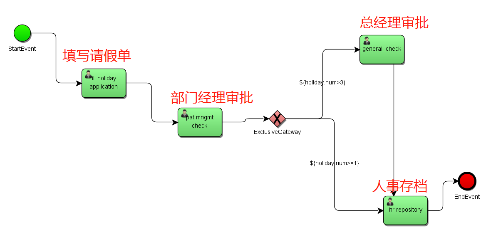


### 部署

```java
/** 部署流程 涉及到的表：
     * act_re_deployment： 部署信息
     * act_re_procdef：流程定义的一些信息
     * act_ge_bytearray: 流程定义的png和bpmn文件
     * */
    @GetMapping("/deploy")
    public void deploy(){
        //1.获取processEngine实例
        ProcessEngine processEngine = standaloneProcessEngineConfiguration.buildProcessEngine();

        //2.获取repositoryService实例
        RepositoryService repositoryService = processEngine.getRepositoryService();
        //3.进行部署
        Deployment deploy = repositoryService.createDeployment()
                .addClasspathResource("diagram/holiday-exclusive.bpmn")//添加bpmn资源
//                .addClasspathResource("diagram/holiday4.png") //添加png资源
                .name("请假流程-流程变量")//部署的名字
                .deploy();//执行部署
        System.out.println(deploy.getId());
        System.out.println(deploy.getName());
    }
```

查看表结构

`act_ge_bytearray`

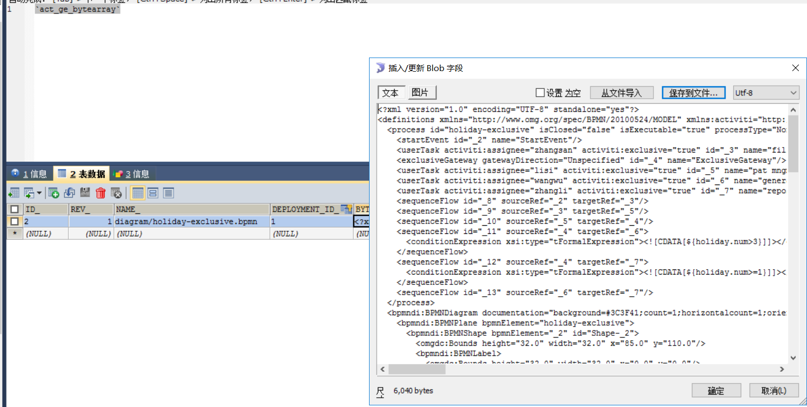

`act_re_deployment`

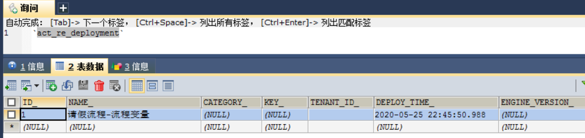

`act_re_procdef`

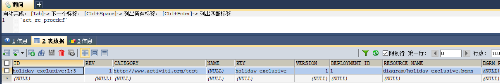

### 启动流程实例

```java
@GetMapping("/startInstance")
    public void startInstance(){

        //1.得到processEngine
        ProcessEngine processEngine = standaloneProcessEngineConfiguration.buildProcessEngine();

        //2.得到runtimeservice对象
        RuntimeService runtimeService = processEngine.getRuntimeService();
        String key = "holiday-exclusive"; //holiday4.bpmn的流程定义id，画bpmn图中的id
        Map<String,Object> map = new HashMap<>();
        Holiday holiday = new Holiday();
        holiday.setNum(5F);
        // ${holiday.num<=3}
        map.put("holiday", holiday);
        //在实例启动的时候设置流程变量
        //通过部署id进行启动
//        runtimeService.startProcessInstanceById()
        //通过key进行启动
        ProcessInstance instance = runtimeService.startProcessInstanceByKey(key,"10002", map);
   
        //3.5 创建流程实例方式5：通过instanceBuilder进行启动
        ProcessInstanceBuilder processInstanceBuilder = runtimeService.createProcessInstanceBuilder();

        //4.输出相关信息, 在表`act_hi_taskinst`可以找到流程实例相关的信息
        System.out.println("流程部署id："+instance.getDeploymentId());//null
        System.out.println("流程进程id："+instance.getProcessInstanceId());//null
        System.out.println("流程定义id："+instance.getProcessDefinitionId());//myProcess_1:3:2508 见表`act_re_procdef`
        System.out.println("流程实例id："+ instance.getId());//5005 见表`act_hi_taskinst`
        System.out.println("活动id："+instance.getActivityId());//null
        System.out.println("流程实例name："+instance.getName());//null
    }
```

## 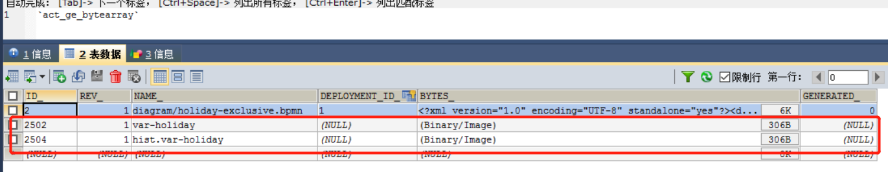

### 查询张三的任务并完成

```
@GetMapping("/taskQueryAndComplate")
    public void test(){
        //1.得到processEngine
        ProcessEngine processEngine = standaloneProcessEngineConfiguration.buildProcessEngine();

        //2.得到taskService对象
        TaskService taskService = processEngine.getTaskService();
        RuntimeService runtimeService = processEngine.getRuntimeService();

        //3.根据流程定义的key, 流程节点的负责人，实现当前用户的任务列表查询。可以打开bpmn文件，在左边的id位置找到key,
        // 也可以在数据的`act_re_procdef`表的KEY_列中找到。查询的表是act_hi_taskinst
        List<Task> taskList = taskService.createTaskQuery()
                .processDefinitionKey("holiday-exclusive")
                //通过负责人来查询
                .taskAssignee("zhangsan")
                .list();
        for(Task task : taskList) {
            Map<String,Object> map = new HashMap<>();
            Holiday holiday = new Holiday();
            holiday.setNum(1F);
            // ${holiday.num<=3}
            map.put("holiday", holiday);
            //4.得到任务的流程实例id
            String processInstanceId = task.getProcessInstanceId();

            //5.通过流程实例id得到流程实例对象。查询的表是act_hi_procinst
            ProcessInstance processInstance = runtimeService.createProcessInstanceQuery().processInstanceId(processInstanceId).singleResult();

            //6.通过流程实例对象得到BusinessKey
            String businessKey = processInstance.getBusinessKey();

            //7.根据businessKey可以得到请假单信息
            System.out.println("businessKey: " + businessKey);

            //8.任务完结
            if (task != null) {
                taskService.complete(task.getId());
                System.out.println("任务完成！！！");
            }else{
                System.out.println("未查到任务！！！");
            }
        }
```

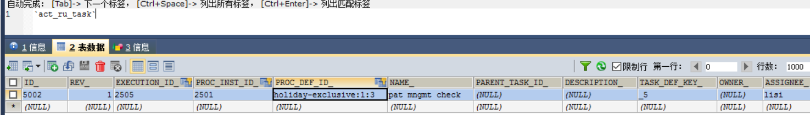

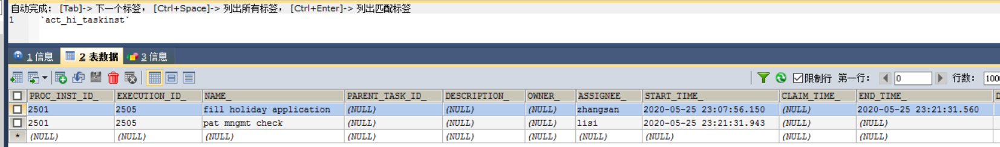

### 查询李四并且完成任务

修改上面的代码为`.taskAssignee("lisi")`，然后执行

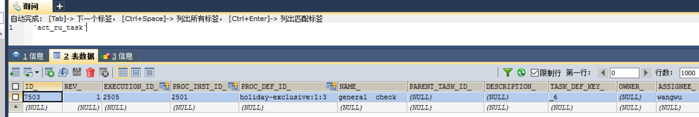

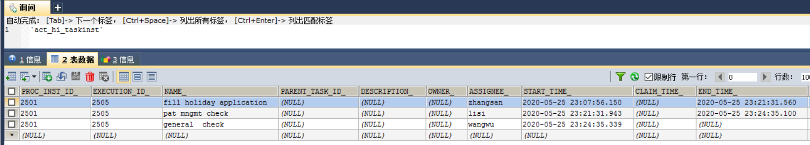

发现是需要wangwu来执行，请假天数是5（holiday.num = 5），两个分支都为true，为什么不是两个分支都满足一起执行呢（没排他网关的时候）？或者说为什么不是直接到`人事存到流程`呢？

因为`总经理审批`的id比`人事存档`小。

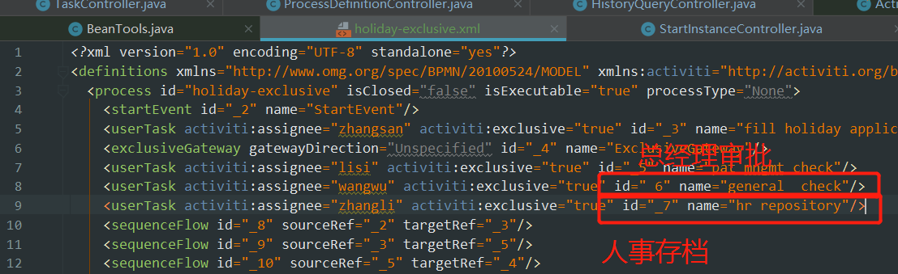

## 个人任务

### 查询任务和完成任务

> 参考：com.javasea.workflow.activiti.controller.TaskController
>
> 查询url：http://localhost:8080/taskQueryAndComplate


## 组任务

1. 查询组任务

   指定候选人，查询候选人当前的待办任务。

   候选人不能办理任务。

2. 拾取任务

   该组任务的候选人都能拾取。

   将候选人的组任务，变成个人任务，原来候选人就变成了任务的负责人。

   > 如果拾取后不想处理，则需要归还任务

3. 查询个人任务

   跟个人任务一样，根据assignee查询用户负责的个人任务。

4. 办理个人任务

## 通过activiti-app.war画流程图

