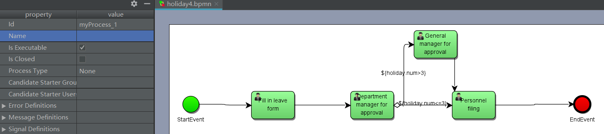
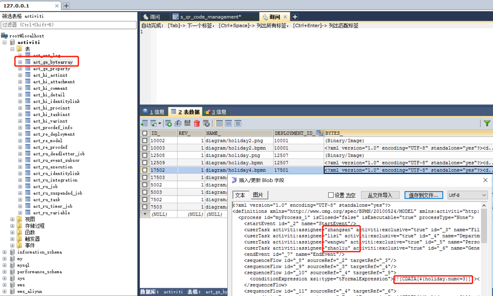
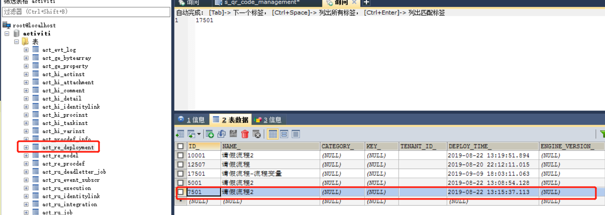
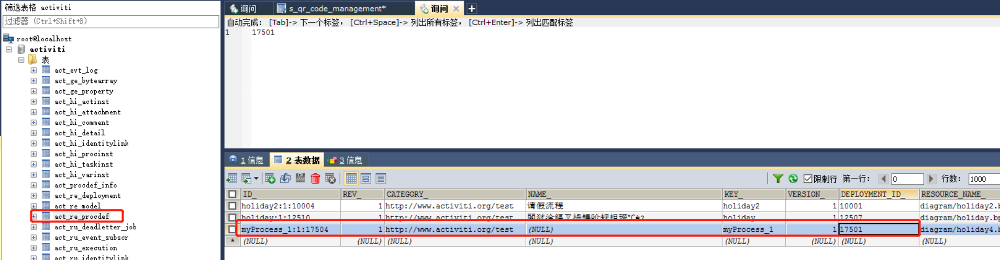

## activity建表

### 创建数据库

```sql
DROP DATABASE activiti;
CREATE DATABASE activiti;
```

### 创建表

## API操作：

### 流程定义相关

### 流程实例相关


### 任务相关

```java
//没参与者，但是候选人是该user
List<Task> taskList = taskService.createTaskQuery().taskCandidateUser(user.getId()).list();
//本人就是参与者
List<Task> assigneeList = taskService.createTaskQuery().taskAssignee(user.getId()).list(); 
//没有参与者，但是候选人相同group的
List<Task> candidateGroup = taskService.createTaskQuery().taskCandidateGroupIn(roleString).list(); 
```

流程变量设置方式：




## 先进行流程定义和部署

> 参考：com.javasea.workflow.activiti.controller.ProcessDefinitionController
>
> url：localhost:8080/process-definition/deploy

```java
@GetMapping("/deploy")
public void deploy(){
    //1.获取processEngine实例
    ProcessEngine processEngine = standaloneProcessEngineConfiguration.buildProcessEngine();

    //2.获取repositoryService实例
    RepositoryService repositoryService = processEngine.getRepositoryService();

    //3.进行部署
    Deployment deploy = repositoryService.createDeployment()
            .addClasspathResource("diagram/holiday4.bpmn")//添加bpmn资源
            .addClasspathResource("diagram/holiday4.png") //添加png资源
            .name("请假流程-流程变量")//部署的名字
            .deploy();//执行部署
    System.out.println(deploy.getId());
    System.out.println(deploy.getName());
}
```

执行后查询数据库：







## 启动流程实例

> 参考：com.javasea.workflow.activiti.controller.StartInstanceController
>
> url：<http://localhost:8080/startInstance>

## 查询任务和完成任务

> 参考：com.javasea.workflow.activiti.controller.TaskController
>
> 查询url：http://localhost:8080/taskQueryAndComplate


