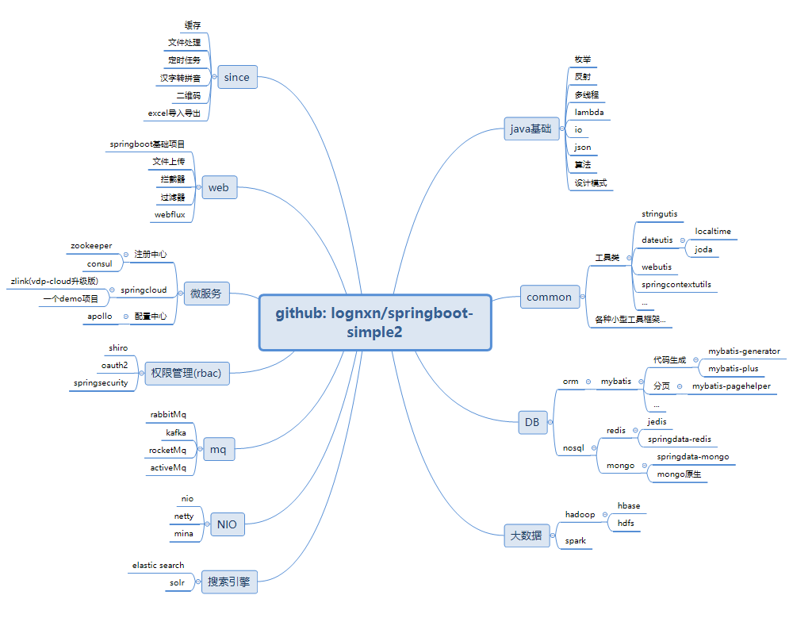
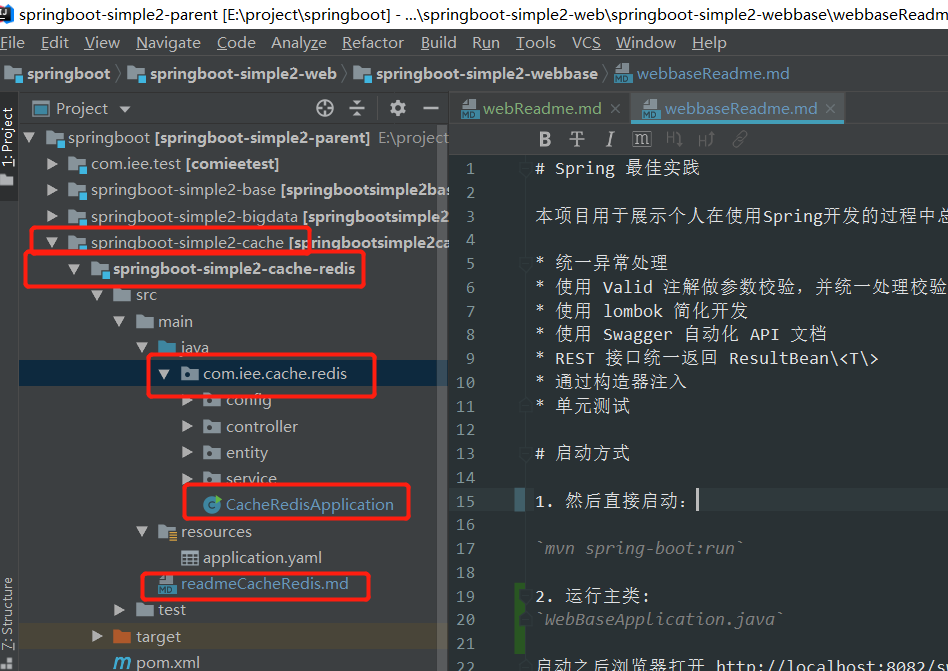
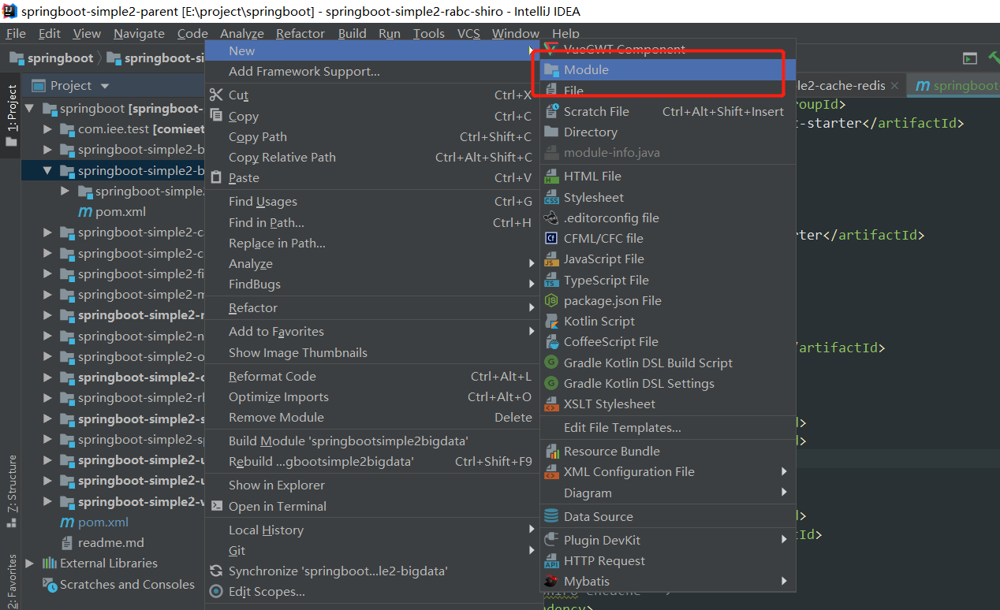
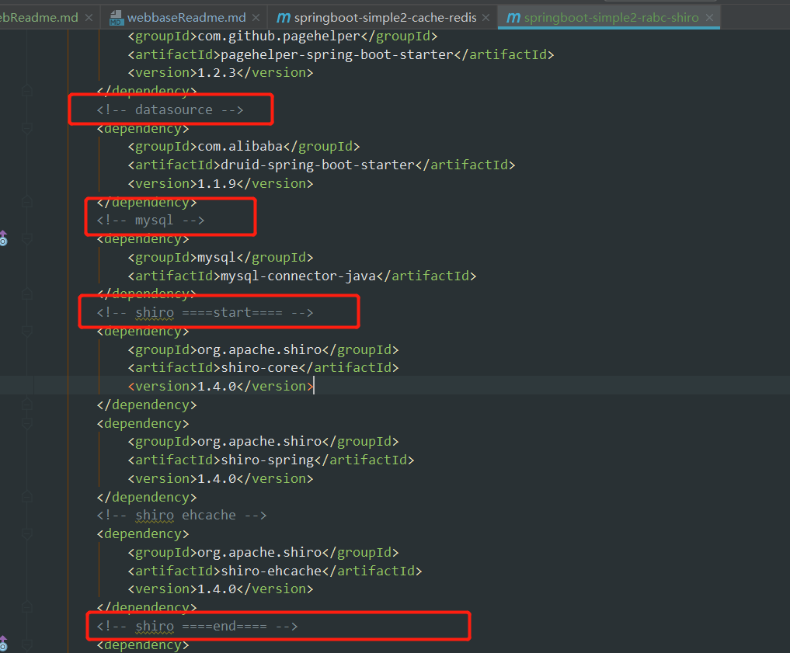

[toc]
### 愿景
打造一个基于springboot的java全知识栈项目。
都是总结好的代码，拿去即用，提高开发效率。
### 项目目录结构
项目名称：springboot-simple2
每个大的知识分类是一个springboot-simple2项目下的二级项目
具体每个知识点是三级项目。
项目用于分级请参考脑图：

### 启动项目
下载下来后，通过运行springboot的启动类启动。

### 参与项目
#### 命名规范
项目名，子项目名，包名，启动类名，readme名称规范：

#### 创建子项目
选择相应的项目，通过新建模块的方式创建子项目。二级项目和三级项目都是该方式进行创建

#### pom配置规范
1. 请将添加的依赖分类整理放好，添加相关的备注。

2. 将三级项目的pom.xml中的<parent>修改为springboot的parent，减少对二级和一级项目的依赖。使之就算单独拷贝出去也能独立运行。

