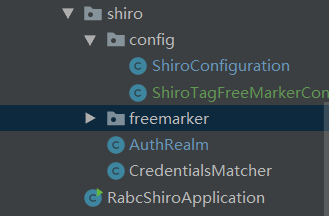

##<center>springboot整合shiro</center>

###使用到的框架
1. springboot：基础框架
2. freemarker：作为前端页面展示，需要配置pom和application.yaml
3. shiro：权限管理，需要配置pom。其他配置见包`com.iee.rabc.shiro.shiro`
该包的结构为：

```
|--config
|    |--ShiroConfiguration   #shiro的相关配置
|    |--ShiroTagFreeMarkerConfigurer   #用于freemker支持shiro标签
|--freemarker  #用于freemarker支持shiro标签
|--AuthRealm   #shiro的域配置
|--CredentialsMatcher   #自动shiro的密码校验方式
```

备注：
fremarker不能使用shiro标签，在本项目中已经添加了开源项目shiro-freemarker-tags的代码，见com.iee.rabc.shiro.shiro.freemarker包下。
shiro-freemarker-tags项目的git地址如下：
https://github.com/jagregory/shiro-freemarker-tags


